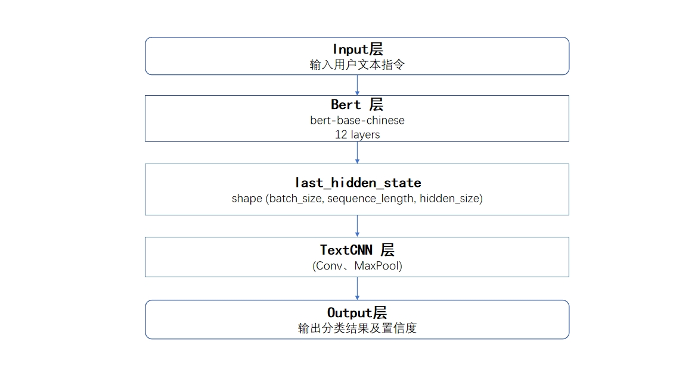

# 模型名称

   WorkBrain-V1.0

## 模型介绍

   WorkBrain是一种先进的智能体模型，可以通过输入的数据进行自主决策，以实现对各种任务的自动化处理。旨在通过集成多种专家模型来处理和生成文 本、图像、语音等多种类型的数据。该架构利用稀疏门控网络和激活权重机制，实现了高效的模型选择和数据处理。
   模型架构图如下：

   

## WorkBrain-V1.0

**WorkBrain-V1.0** 是一款基于 **LLM** 技术的智能体模型，旨在通过 **集成多种专家模型** 来处理和生成文本、图像、语音等多种类型的数据。该架构利用 **稀疏门控网络** 和 **激活权重机制**，实现了高效的模型选择和数据处理。

**WorkBrain-V1.0** 可以高效部署到终端设备。其特点包括：

- 🔥 **优秀的性能。**

   WorkBrain-V1.0 在多个测试基准展示了**最佳性能**。**并且通过了获得国家网信办大模型备案**。
  
- 🏆 **可信行为。**

  多模态大模型深受幻觉问题困扰，模型经常生成和图像中的事实不符的文本。 WorkBrain-V1.0 是 一个**采用多模态 RLHF 对齐的端侧多模态大模型**。  WorkBrain-V1.0 可以在不同的任务上实现**多模态对齐**，从而提高模型的鲁棒性和泛化能力。

- 🌟 **支持多模态输入输出。**

   WorkBrain-V1.0 可以接受 **文本、语音、图像等多模态数据输入和输出**，并且可以感知到小物体、密集文字等更加细粒度的视觉信息及客体对象、环境信息、情感信息等。

- ⚡️ **高效部署。**

   WorkBrain-V1.0 可以**高效部署在大多数消费级显卡**，包括**移动终端设备、竖屏、全息舱等**。我们通过将数据表示压缩为更少的 token。这使得WorkBrain-V1.0 **能占用较低的存储并展现优秀的推理速度**。

- 🙌 **双语支持。**

   WorkBrain-V1.0 **提供领先的中英双语多模态能力支持**。该能力通过多模态能力的跨语言泛化技术实现。

## WorkBrain-V1.0 Demo
   - 文本生成交互效果
   
   - 文本生成和以文生图交互效果
    
   - 图片理解描述交互效果
   
   - 视频理解对话交互效果
   
   - 语音识别交互效果
      
   - 语音合成交互效果 
    
   - 文档问答交互效果 
    
   
### 主要组件

1. 数据输入
    - 支持格式：文本、图片、语音、视频、常见文档等。
2. 前向传播
    - Gate Net：稀疏门控网络，通过softmax门控函数对输入token进行概率分布建模，选择前K个专家激活。
3. 专家模型
    - text_generation：文本生成，使用参数冻结的预训练大语言模型网络，包含预训练模型Transformer块，模型参数为33B，使用参数可训练的轻型插件旁路网络，包含插件Transformer块，模型参数为0.19B。
    - image_understanding：图像理解，该模块专注于解析和解释静态图像的内容。它能够识别物体、场景、人物以及它们之间的关系，并可以提供关于图像中所含内容的详细信息。此过程采用视觉Transformer（ViT）技术，用于图像理解分析描述任务。
    - image_generation：图像生成，使用CLIP、U-Net、VAE等模型，模型参数为1B。
    - video_understanding：视频理解，这个模块旨在处理动态视频内容，分析视频中的动作、事件、场景变化等。它可以利用时间序列上的深度学习方法，如3D卷积神经网络（3D CNNs）、时序卷积网络（TCNs）、循环神经网络（RNNs）及其变体（LSTM、GRU），以及多模态融合技术来捕捉视频中的时空信息。
    - asr：自动语音识别，使用Conformer(CNN+self-attention)模型。
    - tts：文本转语音，使用FastSpeech2模型。
    - document_qa：文档解析，使用prompt技术。
    - external_services：第三方接口，提供外设能力。
4. 激活权重
   通过Gate Net选择的专家模型会被激活，权重被调整以适应不同的输入数据。
5. 加权聚合
   激活的专家模型输出结果会被加权聚合，以生成最终的输出结果。
6. 输出结果
   支持格式：文本、图片、语音等附件。

### 模型参数

- text_generation：33B
- image_understanding：1.6B
- image_generation：1B

### 使用方法

- 准备数据输入，确保格式符合支持的类型。
- 通过Gate Net进行前向传播，选择激活的专家模型。
- 根据激活的模型进行数据处理。
- 聚合各模型的输出结果，生成最终输出。

### 安装方法

1. 克隆我们的仓库并跳转到相应目录

```bash
git clone https://github.com/ChengduMinto/WorkBrain.git
cd WorkBrain-V1.0
```

2. 创建 conda 环境

```Shell
conda create -n WorkBrain python=3.10 -y
conda activate WorkBrain
```

3. 安装依赖

```shell
pip install -r requirements.txt
```

### 项目目录

    项目根目录/
    │
    │
    ├── expert_models/
    │   │
    │   ├── text_generation/
    │   │   │
    │   │   ├── data/                # 训练数据
    │   │   │
    │   │   ├── weight/              # 权重文件夹
    │   │   │
    │   │   ├── model                # 模型文件夹
    │   │   │
    │   │   ├── train.py             # 训练程序
    │   │   │
    │   │   └── infer.py             # 推理程序
    │   │
    │   ├── image_understanding/
    │   │   │
    │   │   ├── data/                # 训练数据
    │   │   │
    │   │   ├── weight/              # 权重文件夹
    │   │   │
    │   │   ├── model                # 模型文件夹
    │   │   │
    │   │   ├── train.py             # 训练程序
    │   │   │
    │   │   └── infer.py             # 推理程序
    │   │
    │   ├── image_generation/
    │   │   │
    │   │   ├── data/                # 训练数据
    │   │   │
    │   │   ├── weight/              # 权重文件夹
    │   │   │
    │   │   ├── model                # 模型文件夹
    │   │   │
    │   │   ├── train.py             # 训练程序
    │   │   │
    │   │   └── infer.py             # 推理程序
    │   │
    │   ├── ...                      # 其他子模块
    │   │
    │   └── experts.py               # 专家模型文件
    │  
    │
    │
    ├── prompt_gate_network/         # 提示指令实现门控网络
    │
    │
    │
    ├── model_gate_network/          # 模型训练实现门控网络
    │   │
    │   ├── data/                    # 训练数据
    │   │
    │   ├── model/                   # 权重文件夹
    │   │
    │   ├── model.py                 # 模型文件
    │   │
    │   ├── train.py                 # 训练程序
    │   │
    │   └── infer.py                 # 推理程序
    │
    │
    │
    ├── utils/                       # 插件工具包
    │
    ├── config/                      # 配置文件
    │
    ├── workbrain_main.py            # 主程序，实现与workbrain的交互
    │
    ├── requirements.txt             # 依赖包
    │
    └── README.md                    # 说明文档

### 项目数据集

数据集分为train.txt、test.txt、dev.txt，为八分类问题，对应八种专家模型能力。 其中训练集一共有 160000 条，验证集一共有 10000 条，测试集一共有 10000 条。 其类别为text_generation、image_understanding、video_understanding、image_generation、asr、tts、document_qa、external_services 这八个类别。

train.txt、dev.txt、test.txt 的数据格式：文本\t标签（数字表示）

```Shell
我是一位建筑公司经理，帮我写一篇关于2023年绿色建筑新政策对公司发展的影响的报告。\t0   
帮我画一幅企业办公室里员工开会的场景。\t1   
``` 

class.txt：标签类别（文本）

### 创新点

- 门控网络

    该门控网络模型选用了一种融合架构，将Bert与TextCNN相结合，以实现对中文能力名称的精准分类。具体而言，Bert模型最后一层的输出被用作TextCNN模型的输入数据，以此为基础进一步开展特征学习，最终达成文本分类的目标。为提升模型的泛化性能，我们采用了微调（fine-tuning）策略对整个融合模型进行优化。此方法不仅充分利用了Bert在自然语言处理任务中的预训练优势，还结合了TextCNN在捕捉文本局部特征上的特长，从而构建了一个既能够理解上下文语义又具备高效特征提取能力的分类系统。模型的架构设计如图所示，形象地展示了各组件之间的协作流程。
    
    
- 文本生成模型的零抑制模块

    文本生成模型的零抑制模块应用于调优网络中，首先样本生成逻辑模块获取包括随机样本和调优样本的训练数据和数据来源标记值，将各样本输入第一个预训练解码器组和相应旁路插件网络组，将样本标签值和数据来源标记值输入损失模型；通过预训练解码器组和相应旁路插件网络组的计算，得到各旁路插件网络组输出的组零抑制损失值和最后输出的当前预训练隐层值，以使网络输出模块得到网络输出结果，损失模型确定网络输出结果的总体损失值，并基于总体损失值对各旁路插件网络组中的参数进行调节。该方法通过旁路插件网络实现零抑制正则化训练，避免调优过程中的大模型历史预训练知识的灾难性遗忘问题，提高模型性能。文本生成模型的零抑制模块网络结构图如下：

    

### 模型训练

在expert_models中每个专家模型中运行：

python train.py

### 模型预测

在expert_models中每个专家模型中运行：

python infer.py

### 模型交互使用

终端交互运行： 

python workbrain_main.py

网页交互运行： 

python workbrain_main_web.py

# 开源协议
## 模型协议
- 本仓库中代码依照 Apache-2.0 协议开源
- WorkBrain 模型权重的使用则需要遵循 WorkBrain 模型商用许可协议。
- WorkBrain 模型权重对学术研究完全开放，在填写问卷进行登记后亦允许免费商业使用。
## 声明
- WorkBrain 通过学习大量的文本来生成内容，但它无法理解、表达个人观点或价值判断，它所输出的任何内容都不代表模型开发者的观点和立场。
- 因此用户在使用 WorkBrain 生成的内容时，应自行负责对其进行评估和验证。
- 如果由于使用 WorkBrain 开源模型而导致的任何问题，包括但不限于数据安全问题、公共舆论风险，或模型被误导、滥用、传播或不当利用所带来的任何风险和问题，我们将不承担任何责任。

# 开发机构
本项目由以下机构独立开发：

- 成都明途科技有限公司

## 引用 <!-- omit in toc -->

如果您觉得我们模型/代码/论文有帮助，请给我们 ⭐ 和 引用 📝，感谢!

# 联系我们
如果你想给我们的研发团队和产品团队留言可以通过明途邮箱(BC@mingto.net)或全国统一客服热线(400-001-0224)联系我们。
